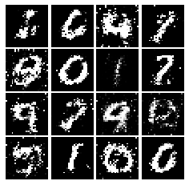
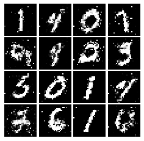
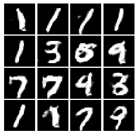

# About
SUTD 50.035 Computer Vision Coursework. For more information, refer to https://istd.sutd.edu.sg/undergraduate/courses/50035-computer-vision.

## Material
### Homework
#### 1. HW1 [Code] - Part 1 (OpenCV exercises), Part 2 (knn & softmax classifier in Tensorflow) 
Part 1 (OpenCV exercises) - load images, transformations, changing color space, 2D convolution (image filtering), average filter, gaussian blurring, median filter, image gradient, histogram equilization, threshold (simple & adaptive)  
Part 2 (k-nearest neighbor & softmax classifier) - train a knn classifier and softmax classifier in Tensorflow

#### 2. HW2 [Code] - Part 1 (Tensorflow exercises), Part 2 (Manual implementation of CNN layers in Tensorflow)
Part 1 (Tensorflow exercises) - create CIFAR10 dataset, initialise and train two/three-layer networks  
Part 2 (Manual forward/backward implementation of CNN layers) - affine, ReLU, softmax, convolution, max-pooling, dropout 

#### 3. HW3 [Code] - Generative Adversarial Networks (GAN), Style Transfer, Network Visualisation in Tensorflow
(i) Generative Adversarial Networks - Vanilla GAN, Least Squares GAN (LS-GAN), Deep Convolutional GAN (DCGAN) on MNIST dataset  
|		  Vanilla GAN	     | 		  Least Squares GAN     |  Deep Convolutionl GAN	     | 
| :---------------------------: |:---------------------------: |:---------------------------: |
|  |  | |

(ii) Style Transfer - Implementation of "Image Style Transfer using Convolutional Neural Networks" (Gatys et al., CVPR 2015) 
(iii) Network Visualisation - Using image gradients to generate new images  
(a) Saliency Maps: Saliency maps are a quick way to tell which part of the image influenced the classification decision made by the network.  
(b) Fooling Images: We can perturb an input image so that it appears the same to humans, but will be misclassified by the pretrained network.  
(c) Class Visualization: We can synthesize an image to maximize the classification score of a particular class; this can give us some sense of what the network is looking for when it classifies images of that class.  
